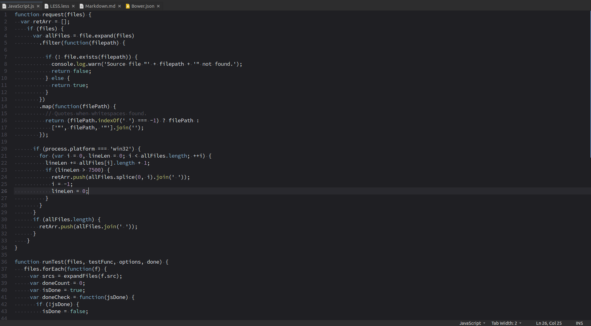

Northem Dark - Gedit Syntax
===========================

### Description
A north-bluish dark theme based on the same named [color palette](https://github.com/arcticicestudio/northem) designed by [Arctic Ice Studio](http://arcticicestudio.com).  
This is a darker and more blue-tinged variation.

### Variations
  - <a href="https://github.com/arcticicestudio/northem-gedit"> Northem gedit</a>
  - <a href="https://github.com/arcticicestudio/northem-light-gedit"> Northem Light gedit</a>

### Other Projects
  - <a href="https://github.com/arcticicestudio/northem-dark-intellij-idea-syntax"> Northem Dark IntelliJ IDEA Syntax</a>   
  - <a href="https://github.com/arcticicestudio/northem-dark-atom-syntax"> Northem Dark Atom Syntax</a>   
  - <a href="https://github.com/arcticicestudio/northem-dark-eclipse-syntax"> Northem Dark Eclipse Syntax</a>   
  - <a href="#"> Northem Dark GTK</a> (in drafting) 
  - <a href="https://github.com/arcticicestudio/northem-dark-notepadplusplus"> Northem Dark Notepad++</a> 

Visit the [official website](http://arcticicestudio.com/northem) (actually under construction) for more information.

### Languages
  -  <a href="https://git.gnome.org/browse/gtksourceview/tree/data/language-specs/css.lang">CSS</a>
  - [diff](https://git.gnome.org/browse/gtksourceview/tree/data/language-specs/diff.lang)
  -  <a href="https://git.gnome.org/browse/gtksourceview/tree/data/language-specs/html.lang">HTML</a>
  -  <a href="https://git.gnome.org/browse/gtksourceview/tree/data/language-specs/java.lang">Java</a>
  -  <a href="https://git.gnome.org/browse/gtksourceview/tree/data/language-specs/javascript.lang">JavaScript</a>
  -  <a href="https://git.gnome.org/browse/gtksourceview/tree/data/language-specs/json.lang">JSON</a>
  -  <a href="https://git.gnome.org/browse/gtksourceview/tree/data/language-specs/perl.lang">Perl</a>
  -  <a href="https://git.gnome.org/browse/gtksourceview/tree/data/language-specs/php.lang">PHP</a>
  -  <a href="https://git.gnome.org/browse/gtksourceview/tree/data/language-specs/python.lang">Python</a>
  -  <a href="https://git.gnome.org/browse/gtksourceview/tree/data/language-specs/ruby.lang">Ruby</a>
  -  <a href="https://git.gnome.org/browse/gtksourceview/tree/data/language-specs/sh.lang">Shell</a>
  -  <a href="https://git.gnome.org/browse/gtksourceview/tree/data/language-specs/xml.lang">XML</a>

### Version
[`0.1.1`](https://github.com/arcticicestudio/northem-dark-gedit-syntax/releases/latest)

For older versions check out the [GitHub Repository](https://github.com/arcticicestudio/northem-dark-gedit-syntax) or [official website](http://arcticicestudio.com/northem) (actually under construction).

### Changelog
[`0.1.1`](CHANGELOG.md)

### Installation
Download and install the recommended font, read section "Recommendations" for more information.

Go to *Edit* > *Preferences* > *Font & Colors* and click on the `+`.  
Alternatively copy the theme file manually, depending on the desired type of installation:
  - Global: `/usr/share/gedit/styles`  
  - User:   `~/.local/share/gedit/styles`

Activate it by going to *Edit* > *Preferences* > *Font & Colors* and select `Northem Dark` from the list.

### Development
#### Workflow
This project follows the [gitflow](http://nvie.com/posts/a-successful-git-branching-model) branching model.

#### Specifications
This project follows the [Arctic Versioning Specification (ArcVer)](https://github.com/arcticicestudio/arcver).

### Dependencies
This theme requires the Open Source font [Source Code Pro](https://typekit.com/fonts/source-code-pro)
Visit the [GitHub Repository](https://github.com/adobe-fonts/source-code-pro) for more information.

  - [`gtksourceview3@3.20.1`](https://developer.gnome.org/gtksourceview/3.20)

#### Production
**Engines**
  - [`gedit@3.20.1`](https://wiki.gnome.org/Apps/Gedit)

#### Development
  - [`northem-dark@1.0.1`](https://github.com/arcticicestudio/northem-dark)

**Engines**
  - [`git@2.8.*`](https://git-scm.com)

**Skeletons**
  - [`glacier-git@0.22.0`](https://github.com/arcticicestudio/glacier-git)

### Contribution
Please report issues/bugs, suggestions for improvements and feature requests to the [issuetracker](https://github.com/arcticicestudio/northem-dark-gedit-syntax/issues).

### Author
[Northem Dark - Gedit Syntax](https://github.com/arcticicestudio/northem-dark-gedit-syntax) is developed and authored by [Arctic Ice Studio](http://arcticicestudio.com).

### Copyright
<a href="mailto:development@arcticicestudio.com"> Copyright &copy; 2015-2016 Arctic Ice Studio</a>

### License
 

---

### References
  - [Northem Dark](http://github.com/arcticicestudio/northem-dark)
  - [Style Scheme Definition](https://developer.gnome.org/gtksourceview/stable/style-reference.html)  
  - [Language Definition](https://developer.gnome.org/gtksourceview/stable/lang-reference.html)  
  - [GtkSourceStyle API](https://developer.gnome.org/gtksourceview/stable/GtkSourceStyle.html)  
  - [GtkSourceStyleScheme API](https://developer.gnome.org/gtksourceview/stable/GtkSourceStyleScheme.html)
  - [Arctic Versioning Specification](http://specs.arcticicestudio.com/arcver) (ArcVer)
  - [gitflow](http://nvie.com/posts/a-successful-git-branching-model)
  - [Glacier - Git](https://github.com/arcticicestudio/glacier-git)
